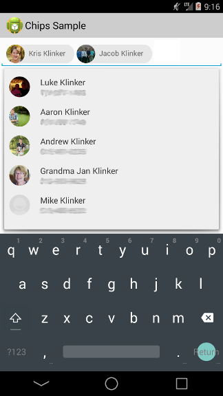

# Android Chips Edit Text #



This is a simple library based on Google's internal chips library and updated to have visuals reflecting the newly released "Material Design" standard as seen [here](http://www.google.com/design/spec/components/chips-tokens.html#chips-tokens-contact-chips).

Usage is extremely simple:

```java
// creates an autocomplete for phone number contacts
final RecipientEditTextView phoneRetv =
        (RecipientEditTextView) findViewById(R.id.phone_retv);
phoneRetv.setTokenizer(new MultiAutoCompleteTextView.CommaTokenizer());
phoneRetv.setAdapter(new BaseRecipientAdapter(BaseRecipientAdapter.QUERY_TYPE_PHONE, this));
```

OR

```java
// creates an autocomplete for email contacts
final RecipientEditTextView emailRetv =
        (RecipientEditTextView) findViewById(R.id.email_retv);
emailRetv.setTokenizer(new Rfc822Tokenizer());
emailRetv.setAdapter(new BaseRecipientAdapter(this));
```

You can get all of the current chips by using:

```java
DrawableRecipientChips[] chips = phoneRetv.getSortedRecipients();
```

---

## License

    Copyright (C) 2014 Jacob Klinker

    Licensed under the Apache License, Version 2.0 (the "License");
    you may not use this file except in compliance with the License.
    You may obtain a copy of the License at

       http://www.apache.org/licenses/LICENSE-2.0

    Unless required by applicable law or agreed to in writing, software
    distributed under the License is distributed on an "AS IS" BASIS,
    WITHOUT WARRANTIES OR CONDITIONS OF ANY KIND, either express or implied.
    See the License for the specific language governing permissions and
    limitations under the License.
